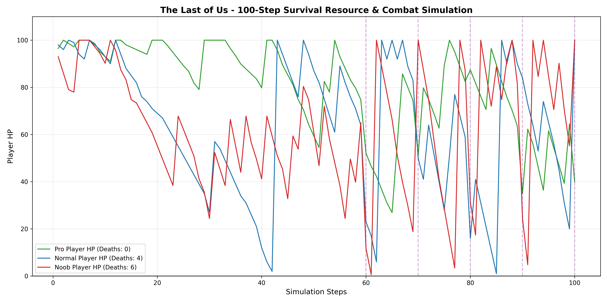

# The Last of Us - Survival Resource & Combat Simulation

This project translates a visual Machinations.io system analysis of *The Last of Us* into a quantitative Python simulation. It models the core tension loop between resource scavenging, crafting decisions, and escalating combat difficulty.

## Overview

The simulation runs for 100 steps and tests three different player profiles (Pro, Normal, and Noob) against identical environmental and combat conditions. All core game variables and difficulty settings (such as base enemy damage, spawn rates, and maximum health) are exposed and fully configurable via the new `config.py` file.

### Player Profiles
* **Pro Player:** High scavenging efficiency (60%), takes less damage (0.7x), favors Molotovs when healthy (HP > 70) but shifts toward Medkits when HP drops to 70 or below.
* **Normal Player:** Moderate scavenging (40%), normal damage (1.0x), balanced crafting above 50 HP, defaults strongly to Medkits at or below 50 HP.
* **Noob Player:** Poor scavenging (30%), takes more damage (1.4x), defaults to Medkits almost entirely at or below 40 HP.

### Game Mechanics
* **Scavenging:** Players collect Alcohol and Rags based on their specific scavenging rates.
* **Inventory Caps:** Raw materials (Alcohol, Rag) are capped at 3 in stock. Crafted items (Medkit, Molotov) are *not* capped — they don't need to be, since both are consumed the instant they're produced rather than stockpiled (see Healing and Molotov notes below).
* **Crafting:** Combining 1 Alcohol and 1 Rag produces either a Medkit or a Molotov, determined probabilistically based on the player's current health threshold.
* **Combat & Damage:** Every incoming hit is floored at a minimum of 1 damage, then scaled by the player's Skill Modifier (Pro 0.7x / Normal 1.0x / Noob 1.4x).
  * **Zombie Horde:** `max(1, (2 + floor(step/10) - Molotov*2) * Skill Modifier)`, applied every step. Damage climbs gradually as the run progresses.
  * **Clicker Attack:** 30% chance per step of `max(1, (3 - Molotov*2) * Skill Modifier)`.
  * **Bloater Attack:** Fires only at steps 60, 70, 80, 90, and 100, dealing `max(1, (30 - Molotov*5) * Skill Modifier)`.
  * **Molotov as a defensive buffer:** any Molotov crafted this step reduces all three damage sources before being consumed — it's used immediately (an "automatic pull" in the Machinations model) rather than stockpiled, so it only ever buffers the same step it was made.

    *Note: this diverges from the original game, where both Medkits and Molotovs are stockpilable items the player times manually. The model abstracts both into automatic, single-step consumption to keep the resource-allocation dilemma (offense vs. healing) analytically simple — consistent with the other deliberate simplifications (stealth, ammo) noted in the source report.*
* **Healing:** Like Molotovs, Medkits are consumed the instant they're crafted rather than stockpiled. If HP is below 100 the same step a Medkit is produced, it's used immediately to restore 35 HP; if HP is already full that step, the Medkit is discarded rather than saved for later. If a player's HP drops to 0 or below, a Death is recorded and they respawn at 100 HP.

## Output
Running the script outputs a graphical chart (`simulation_results.png`) showing the three players' HP trajectories over 100 steps, with the five Bloater spike steps marked. It illustrates how resource scarcity in the late game leads to death loops for less efficient players.



**On randomness:** the script uses no fixed random seed, so exact death counts will differ between runs. What stays consistent across runs is the *pattern*: the Pro Player reliably survives with the fewest deaths, the Noob Player reliably struggles the most, and the Normal Player falls in between — matching the original Machinations model's conclusion that survival is governed by the relationship between inventory limitations and escalating enemy pressure, not by any single lucky run.

## How to Run

1. Ensure you have Python installed.
2. Install `matplotlib` if you haven't already (`pip install matplotlib`).
3. (Optional) Adjust game mechanics and difficulty by editing `config.py`.
4. Run the script:
   ```bash
   python simulation.py
   ```
5. View the generated `simulation_results.png` graph.
